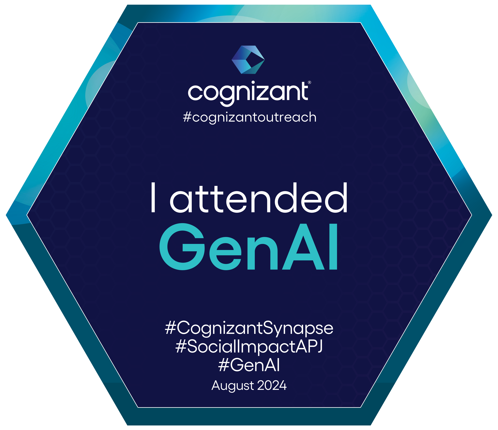
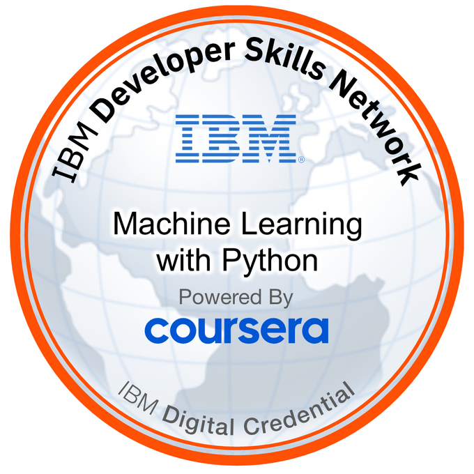
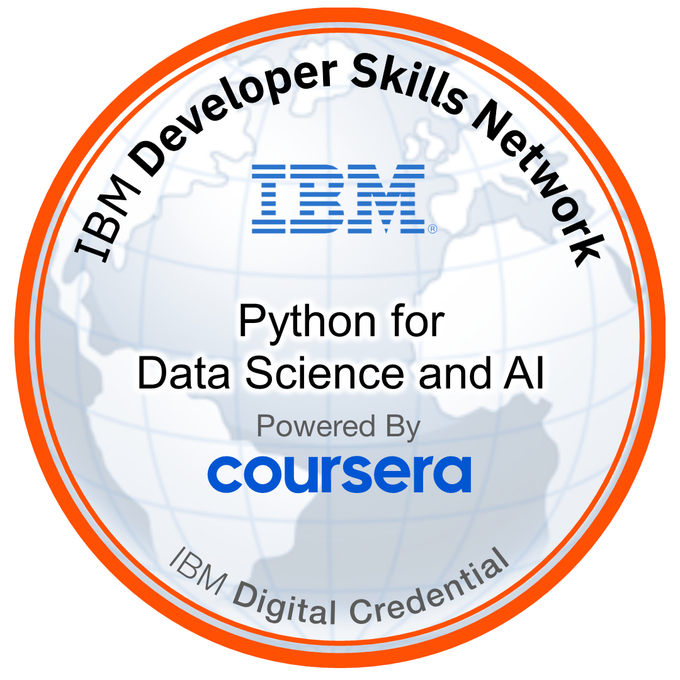
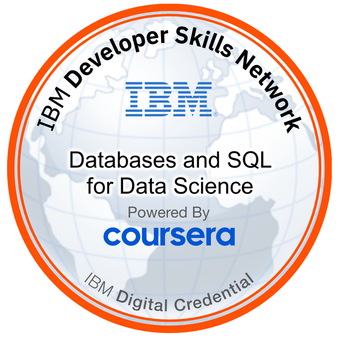

## About Me:
👨‍🎓 I am currently pursuing a Master of Artificial Intelligence with a specialization in Computer Vision at the University of Technology Sydney (UTS), Australia.   
📚 Passionate about exploring and writing on Data Analytics, Machine Learning, AI, and Computer Vision.   
🌱 A lifelong learner, constantly keeping up with the latest trends in Data and AI.  
💬 Feel free to ask me about Data Science, Analytics, ML algorithms, NLP, and Computer Vision.  
🤝 Open to collaboration and knowledge-sharing on innovative projects.   
[Visit My Webpage](https://zagarsuren.github.io)

## Tech Stacks:
     
  

## Technical Badges:

|**Generative AI**|[**Machine Learning**](https://www.credly.com/badges/cd6f727c-d1ac-4095-b0fe-d3d29053ffd3/public_url)|[**Data Science and AI**](https://www.credly.com/badges/0afd62d5-b75c-4186-886d-959ddbc82971/public_url)|[**Data Analysis**](https://www.credly.com/badges/d697b5c0-18b8-41cb-b095-75a0fd581119/public_url)|[**SQL**](https://www.credly.com/badges/01b0f88b-ca10-47d8-ad43-3dd42e247d19/public_url)|
|:---:|:---:|:---:|:---:|:---:|
||||||
<!--
**zagarsuren/zagarsuren** is a ✨ _special_ ✨ repository because its `README.md` (this file) appears on your GitHub profile.

Here are some ideas to get you started:

- 🔭 I’m currently working on ...
- 🌱 I’m currently learning ...
- 👯 I’m looking to collaborate on ...
- 🤔 I’m looking for help with ...
- 💬 Ask me about ...
- 📫 How to reach me: ...
- 😄 Pronouns: ...
- ⚡ Fun fact: ...
-->